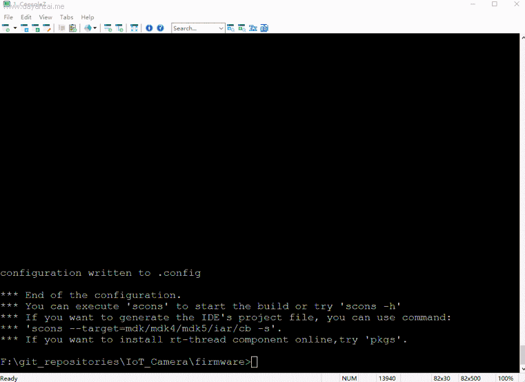

# Iot Camera 快速入门手册
本手册说明如何使用env工具对Iot Camera进行开发。env工具可以去官网下载最新的版本使用。下载地址：

`http://www.rt-thread.org/page/download.html`

如果没有使用过env工具，请先参考rtt说明文档，对env的使用有一个简单的了解，env工具自带的ppt也是入门env很好的教程。

`https://github.com/RT-Thread/rtthread-manual-doc/blob/master/zh/5chapters/01-chapter_env_manual.md`

## 1.将rt-thread拷贝到IoT_Camera\firmware目录下

可以使用git工具将rt-thread源代码clone到IoT_Camera\firmware目录下，也可以从别处拷贝一份rt-thread到IoT_Camera\firmware目录下。

## 2.使用env工具切换到IoT_Camera\firmware目录并编译

接下来就可以将获得的rtthread.bin来进行烧录运行了。

## 3.开启wifi功能

wifi功能默认是没有开启的，可以使用env来下载相关的组件包来使用wifi功能。

更新好在线组件包之后，重新编译下载即可。

## 4.查看命令帮助的方法

如果想查看某个命令的使用帮助，可以在msh命令行中输入命令+help查询。
例如输入`wifi help`查看wifi指令的帮助信息。可以看到wifi的帮助指令：

    wifi wlan_dev scan
    wifi wlan_dev join SSID PASSWORD
    wifi wlan_dev ap SSID [PASSWORD]
    wifi wlan_dev up
    wifi wlan_dev down
    wifi wlan_dev rssi
    wifi wlan_dev status

在iot camera的3.0版本中中如果wifi正常初始化，则wlan_dev为w0,可以使用`wifi w0 join SSID PASSWORD`命令来加入wifi。

