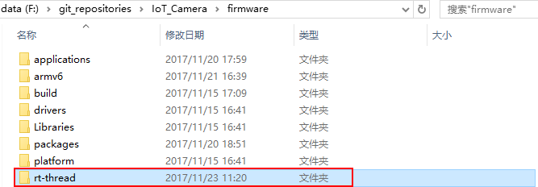
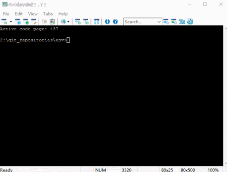

# Iot Camera 快速入门手册
本手册说明如何使用env工具对Iot Camera进行开发。env工具可以去官网下载最新的版本使用。下载地址：

`http://www.rt-thread.org/page/download.html`

如果没有使用过env工具，请先参考rtt说明文档，对env的使用有一个简单的了解，env工具自带的ppt也是入门env很好的教程。

`https://github.com/RT-Thread/rtthread-manual-doc/blob/master/zh/5chapters/01-chapter_env_manual.md`

## 1.将rt-thread拷贝到IoT_Camera\firmware目录下

可以使用git工具将rt-thread源代码clone到IoT_Camera\firmware目录下，也可以从别处拷贝一份rt-thread到IoT_Camera\firmware目录下。

## 2.使用env工具切换到IoT_Camera\firmware目录并编译

接下来就可以将获得的rtthread.bin来烧录运行了。

